# 🎯 ClarifaiSQL

This is a full-stack AI application that converts natural language questions into SQL queries. Upload your CSV files, ask questions in plain English, and get accurate SQL queries with detailed explanations.

<p align="center">
  
  
  
  
  
</p>

## Features

- **AI-Powered SQL Generation**: Convert natural language to SQL using Google Gemini API.
- **CSV File Upload**: Drag and drop CSV files for data analysis.
- **Real-time Query Execution**: Instant SQL query generation and execution.
- **Query Explanations**: Detailed explanations of generated SQL queries.
- **Modern UI**: Responsive design built with Next.js and TailwindCSS.

## Tech Stack

| Category   | Technology                    |
|------------|-------------------------------|
| Frontend   | Next.js 15, TypeScript, TailwindCSS |
| Backend    | FastAPI, Python 3.11+, Uvicorn  |
| Database   | SQLite (in-memory)            |
| AI         | Google Gemini API             |

## System Architecture

```mermaid
flowchart LR
    A[User] -->|1. Upload CSV and Ask Question| B[Next.js Frontend]
    B -->|2. API Request with File and Question| C[FastAPI Backend]
    C -->|3. Create In-Memory DB and Build Prompt| C1[Prompt Builder]
    C1 -->|4. Send Prompt with Schema and Question| D[Google Gemini API]
    D -->|5. Return SQL Query and Explanation| C2[SQL Processor]
    C2 -->|6. Execute SQL on In-Memory DB| C3[SQLite In-Memory DB]
    C3 -->|7. Send JSON Response with Query and Results| B
    B -->|8. Display Query, Explanation and Data| A
```



## Local Setup & Installation

### Prerequisites

- Node.js v18 or higher
- Python v3.11 or higher
- Google Gemini API key

### 1. Clone the Repository

```
git clone https://github.com/tejas-bhise/clarifaisql.git
cd clarifaisql-monorepo
```

### 2. Backend Setup

Navigate to the backend directory:

```
cd backend
```

Create and activate a virtual environment:

```
python -m venv .venv
.venv\Scripts\activate  # On Windows
source .venv/bin/activate  # On macOS/Linux
```

Install dependencies:

```
pip install -r requirements.txt
```

Create a `.env` file and add your Gemini API key:

```
GEMINI_API_KEY="your-gemini-api-key-here"
```

Run the backend:

```
python main.py
```

It will run at [http://127.0.0.1:8000](http://127.0.0.1:8000).

### 3. Frontend Setup

In a new terminal, go to the frontend directory:

```
cd frontend
```

Install dependencies:

```
npm install
```

Start the React server:

```
npm run dev
```

It will run at http://localhost:3000.

## Project Structure

```
CLARIFAISQL-MONOREPO/
├── backend/
│   ├── main.py
│   ├── requirements.txt
│ 
└── frontend/
    ├── app/
    ├── components/
    ├── public/
    ├── package.json
    └── next.config.ts
```

## How It Works

1. **Upload CSV**: User uploads CSV file through the React frontend
2. **Ask Questions**: User types natural language questions about the data
3. **API Processing**: Frontend sends request to FastAPI backend
4. **AI Generation**: Backend uses Gemini API to convert question to SQL
5. **Database Query**: Generated SQL is executed against SQLite database
6. **Results Display**: Frontend shows SQL query, explanation, and results

## License

This project is under the MIT License. See the LICENSE file for details.
```